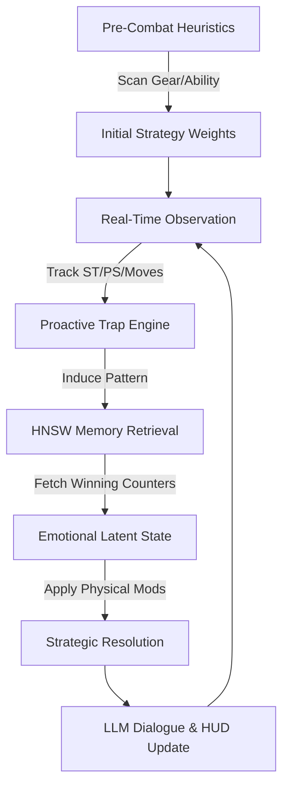

# MIRAI v.2 (Memory-Integrated Relational Adaptive Intelligence)
### **The Autonomous Adversary**

**MIRAI** is a memory-augmented, gear-aware, and emotionally-weighted AI boss system inspired by **NVIDIA ACE** and the **MIR5** architecture. Unlike traditional game bosses with static scripts, MIRAI utilizes a multi-layered cognitive pipeline to observe, induce, and counter player behavior in a high-stakes psychological duel.

---

## 🧠 Core Architecture: The Cognitive Pipeline

MIRAI operates on a **Continuous Learning Feedback Loop** that spans physics, psychology, and structural heuristics:



---

## 🔥 Key Systems (v2 Evolution)

### 1. Kinetic Resource Engine (The "Body")
- **Stamina (ST)**: Every action has a physical cost. Players can "exhaust" the boss, but MIRAI also tracks player stamina to predict fatigue.
- **Posture (PS)**: A balance-based system. Breaking posture results in a **Stagger Lock** (1 turn skip, 1.5x damage taken).
- **Parry Mechanics**: High-priority counters that nullify damage and shatter the attacker's balance.

### 2. Cognitive Strategy & Trap Engine (The "Mind")
- **Proactive Pattern Induction**: MIRAI doesn't just react; it **baits**. It intentionally seeds patterns (e.g., repeating attacks) to lure the player into a predictable counter, only to spring a lethal **Trigger Move**.
- **Outcome-Based Meta-Learning**: Uses **FAISS (HNSW Indexing)** to search thousands of historical fights not just for similarity, but for **Winning Strategies**.

### 3. Structural Intelligence (The "Gear")
- **Loadout Selection**: Players choose from a suite of **Shields** (Buckler, Greatshield, Vanguard) and **Special Abilities** (Focus Pulse, Titan's Wrath, Overdrive).
- **Heuristic Analysis**: MIRAI performs a "Neural Scan" of player equipment before Turn 1, adjusting its initial tactical weights to counter the selected build.

### 4. Emotional Mechanical Weighting (The "Spirit")
- **Dynamic Physics**: MIRAI's simulated moods (**DOMINANT**, **IRRITATED**, **DESPERATE**) directly alter its physical stats (Damage, Defense, Posture, Regen).
- **UI Synchronicity**: The HUD glitches and shifts color based on MIRAI's frustration or confidence.

---

## 🛠 Technical Stack

- **Backend**: FastAPI (Python 3.13), FAISS-cpu (HNSW Vector Search), NumPy.
- **AI/LLM**: Ollama (Llama 3.2), Markov Chain (N-Gram Prediction).
- **Frontend**: Next.js 15 (React 19), Tailwind CSS 4, Framer Motion (HUD Animations).
- **Styling**: Custom "Terminal-Core" CSS for immersive feedback.

---

## 🚀 Installation & Setup

### 1. Prerequisites
- **Python 3.13+**
- **Node.js 18+**
- **Ollama** (Download from [ollama.com](https://ollama.com))

### 2. Setup Ollama
```bash
ollama run llama3.2
```

### 3. Backend Implementation
```bash
# Navigate to project root
cd MIRAI

# Setup Environment
python -m venv venv
source venv/bin/activate  # or .\venv\Scripts\activate on Windows

# Install & Run
pip install -r requirements.txt
python backend/main.py
```

### 4. Frontend Deployment
```bash
# Navigate to frontend directory
cd mirai-frontend

# Install & Launch
npm install
npm run dev
```

---

## 🛡️ The Laws of Adaptive Fairness
To ensure a challenging but unbiased experience, MIRAI follows four foundational laws:
1.  **Law of Shared Physicality**: MIRAI is bound by the same Stamina/Posture rules as the player.
2.  **Law of the Transparent Brain**: MIRAI's confidence and current Trap Protocol are visible on the HUD.
3.  **Law of Emotional Fallibility**: High frustration reduces the AI's prediction accuracy.
4.  **Law of Recovery**: Boss "Trumps" require cooldowns and leave vulnerable windows.

---

## 📜 License
MIRAI is an experimental AI project designed for research into adaptive adversarial systems.
