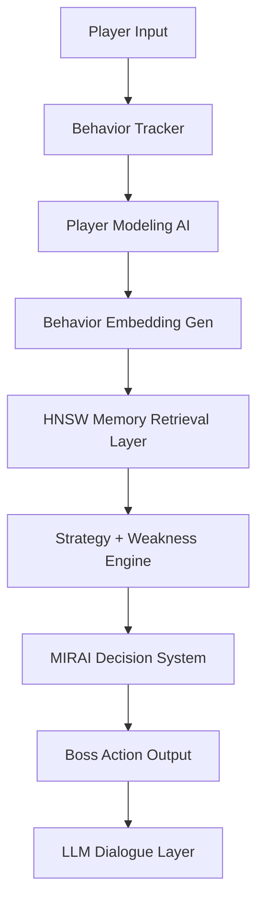

# MIRAI V.4: Tactical Neural Combat Interface

**MIRAI** (Memory-Integrated Relational Adaptive Intelligence) is a memory-augmented adversarial AI system. Unlike traditional game bosses with static "if-then" logic, MIRAI utilizes real-time behavior tracking, vector embeddings, and an HNSW-indexed memory layer to observe, learn, and counter the player's unique psychological fighting style.

---

## 🧠 Core Architecture: The Neural Pipeline

MIRAI follows a strict **Behavior-to-Decision** pipeline that allows it to build a persistent profile of the player:



---

## 🔥 Key Features

### 1. Tactical Combat HUD (Immersive UI)
- **Visual Intensity**: Scanline animations, CRT-style grid overlays, and tactical corner brackets.
- **Mechanical HP HUD**: Mechanical "Power Core" bars with high-contrast health indicators.
- **Dynamic Danger Feedback**: Real-time "Danger Flash" animations during damage events.
- **Cognitive Trace Aside**: A live panel showing MIRAI's internal thought process, match confidence, and vector distribution.

### 2. Behavioral AI Engine
- **Aggression Score**: Tracks frequency of heavy and basic attacks.
- **Defense Score**: Monitors reliance on defensive stances.
- **Panic Detection**: Identifies "Panic Healing" (healing under 30% HP).
- **Trickster Detection**: Tracks "Bluff" actions used to mask predictability.

### 3. HNSW Vector Memory (FAISS)
- **Long-Term Persistence**: Uses **FAISS (Facebook AI Similarity Search)** to maintain a Hierarchical Navigable Small World (HNSW) graph index.
- **Pattern Recognition**: Converts player behavior into 4D vectors `[Aggression, Defense, Panic, Predictability]` and searches history for the most similar past fights.
- **Adaptive Countering**: MIRAI identifies what defeated similar players in the past and prioritizes those moves.

### 4. LLM Dialogue Engine (Llama 3.2)
- **Clinical Personality**: MIRAI is cold, observational, and minimal.
- **Pattern Awareness**: Generates context-aware lines like *"You heal at predictable thresholds"* or *"No variation detected"* based on the AI's certainty.
- **Memory Persistence**: Acknowledges if "Mirai Remembers You" from previous sessions.

---

## 🛠 Technical Stack

### Backend
- **Framework**: FastAPI (Python 3.13)
- **Vector Engine**: FAISS-cpu (HNSW Indexing)
- **Math/Logic**: NumPy
- **LLM**: Ollama (Llama 3.2)
- **Server**: Uvicorn

### Frontend
- **Framework**: Next.js 15 (React 19)
- **Styling**: Tailwind CSS 4 + Custom Tactical CSS
- **Language**: TypeScript

---

## 🚀 Installation & Setup

### 1. Prerequisites
- **Python 3.13+**
- **Node.js 18+**
- **Ollama** (Download from ollama.com)

### 2. Setup Ollama
Download and run the Llama 3.2 model:
```bash
ollama run llama3.2
```

### 3. Backend Setup
```bash
# Navigate to project root
cd MIRAI

# Create and activate virtual environment
python -m venv venv
.\venv\Scripts\activate

# Install dependencies
pip install -r requirements.txt

# Run the backend
python backend/main.py
```

### 4. Frontend Setup
```bash
# Navigate to frontend directory
cd mirai-frontend

# Install dependencies
npm install

# Run the development server
npm run dev
```

---

## 📂 Project Structure

```text
MIRAI/
├── backend/
│   ├── ai/                 # Core AI Logic
│   │   ├── behavior_tracker.py  # Real-time metrics
│   │   ├── vector_memory.py     # FAISS/HNSW Implementation
│   │   ├── strategy_engine.py   # Decision logic
│   │   └── dialogue_engine.py   # Ollama integration
│   ├── api/                # FastAPI Routes
│   ├── memory/             # Persistent JSON/Index files
│   └── main.py             # Entry point
├── mirai-frontend/
│   ├── src/app/
│   │   ├── globals.css      # Tactical HUD styles
│   │   └── page.tsx         # Combat Interface
└── requirements.txt         # Backend dependencies
```

---

## 🛡️ MIRAI's Memory Schema

### `fight_vectors.json` (Metadata)
Stores historical snapshots of fights, including player types and move frequencies.

### `fight_hnsw.index` (The Brain)
A binary graph file created by FAISS. It allows MIRAI to perform sub-millisecond similarity searches across thousands of historical behavior vectors.

### `player_memory.json` (Identity)
Tracks your current session ID, total match count (Familiarity), and current classified archetype.

---

## 📜 License
MIRAI is an experimental AI project designed for research into adaptive adversarial systems.
